# MythicForge

MythicForge is a decentralized NFT marketplace for unique digital game cards built on the Ethereum Sepolia Testnet.

The project allows users to mint unique game cards, store their artwork and metadata on IPFS, list cards for sale, purchase cards from other users, and view their NFT collection through a modern Web3 interface.

## Project Overview

MythicForge combines blockchain technology, NFTs, IPFS, and Web3 wallet integration to create a decentralized game-card marketplace.

Each game card is represented by a unique ERC-721 NFT with its own token ID. The NFT artwork and rich metadata are stored on IPFS, while important card information such as name, description, rarity, attack, and defense is recorded through the GameCard smart contract.

The marketplace smart contract provides decentralized peer-to-peer trading using Sepolia ETH.

The goal is to provide transparent digital ownership and peer-to-peer trading of unique game cards.

## Live Demo

[MythicForge Live Demo](https://mythic-forge1.vercel.app/)

## Features

### NFT Game Cards

- Mint unique ERC-721 game cards
- Every card receives a unique token ID
- Ten unique game cards are currently included in the project
- Each card contains:
  - Name
  - Description
  - Rarity
  - Attack
  - Defense
  - Element
  - Speed
  - Magic
  - Artwork

### IPFS Storage

- NFT artwork is stored on IPFS
- NFT metadata is stored on IPFS
- Metadata is connected to NFTs through their token URI
- Decentralized storage removes dependence on a centralized image server

### Decentralized Marketplace

- List owned NFTs for sale
- Set a price in Sepolia ETH
- Purchase NFTs from other users
- Cancel active listings
- NFT ownership is transferred through the blockchain
- Marketplace listings are stored on-chain
- Listed NFTs are held in marketplace escrow

### Wallet Integration

- MetaMask wallet connection
- Ethereum Sepolia Testnet support
- Wallet-specific NFT collection
- Blockchain transactions are confirmed through MetaMask

### Marketplace Gallery

- Browse available game cards
- View card rarity
- View attack and defense statistics
- View card prices
- Open detailed NFT information
- Purchase listed NFTs

### Collection Dashboard

- View NFTs owned by the connected wallet
- Display collection statistics
- View rarity information
- Open individual NFT details

### Transaction Feedback

The application provides feedback during blockchain interactions, including:

- Transaction requests
- Transaction submission
- Transaction confirmation
- Transaction failure
- Wallet rejection

## Architecture

MythicForge consists of a React frontend, MetaMask wallet, Ethereum Sepolia smart contracts, and IPFS decentralized storage.

```text
                              MythicForge
                                  |
                  +---------------+---------------+
                  |                               |
                  v                               v
              Frontend                       Blockchain
                  |                               |
        React + TypeScript                 Ethereum Sepolia
                  |                               |
        ethers.js + MetaMask              +-------+-------+
                  |                        |               |
                  |                        v               v
                  |                  GameCard.sol    Marketplace.sol
                  |                        |               |
                  |                        v               |
                  |                   ERC-721 NFTs         |
                  |                                        |
                  +----------------------------------------+
                                  |
                                  v
                                 IPFS
                                  |
                         +--------+--------+
                         |                 |
                         v                 v
                      Artwork          Metadata
Application Flow
User
  |
  v
MythicForge Frontend
  |
  +-----------------------+
  |                       |
  v                       v
MetaMask                  IPFS
  |                       |
  v                       +----> Artwork
Ethereum Sepolia          |
  |                       +----> Metadata
  |
  +-----------------------------+
  |                             |
  v                             v
GameCard.sol              Marketplace.sol
  |                             |
  v                             v
ERC-721 NFTs               NFT Trading
NFT Lifecycle
Mint NFT
   |
   v
Store Artwork + Metadata on IPFS
   |
   v
Store Metadata URI in NFT
   |
   v
NFT Owned by User
   |
   v
Approve Marketplace
   |
   v
List NFT
   |
   v
NFT Held in Marketplace Escrow
   |
   v
Buyer Purchases NFT
   |
   v
NFT Transferred to Buyer
Blockchain
Network
Network: Ethereum Sepolia Testnet
Chain ID: 11155111
Currency: Sepolia ETH
NFT Standard: ERC-721
Smart Contract Language: Solidity
Wallet: MetaMask
GameCard Contract

The GameCard contract implements an ERC-721 NFT collection.

Contract Address

0x2e05C142d522c7b6912017c45b068aE5e064bDb9

View GameCard Contract on Sepolia Etherscan

The contract uses OpenZeppelin's ERC721URIStorage implementation.

Main functionality:

Mint unique NFT game cards
Assign unique token IDs
Store NFT metadata URI
Store important game-card attributes on-chain
Track NFT ownership
Marketplace Contract

The Marketplace contract handles decentralized NFT trading.

Contract Address

0x10eBcaaAbE901DBc33f93Eb2847e455949EC80e5

View Marketplace Contract on Blockscout

Main functionality:

List NFTs
Set NFT prices
Buy listed NFTs
Cancel listings
Transfer NFTs between users
Transfer payment to sellers
Prevent unauthorized listing cancellation
Prevent sellers from purchasing their own listings
Protect purchases using reentrancy protection

The Marketplace contract uses NFT escrow. When an NFT is listed, the NFT is transferred to the marketplace contract until the NFT is purchased or the listing is cancelled.

Smart Contract Details
GameCard.sol

The GameCard smart contract uses:

ERC-721
ERC721URIStorage
OpenZeppelin Contracts
Solidity 0.8.24

Each NFT has:

Unique Token ID
Name
Description
Rarity
Attack
Defense
IPFS Metadata URI

The contract stores important gameplay attributes on-chain while richer metadata and artwork are stored through IPFS.

Marketplace.sol

The Marketplace smart contract uses:

ERC-721 interface
ReentrancyGuard
Solidity 0.8.24

Marketplace operations include:

listCard()
buyCard()
unlistCard()

The contract emits events for marketplace activity:

CardListed
CardSold
CardUnlisted

These events provide an on-chain record of marketplace operations.

Game Cards

MythicForge currently contains ten unique game cards.

Token ID	Card Name	Rarity
#1	Flame Dragon	Legendary
#2	Shadow Knight	Epic
#3	Storm Mage	Rare
#4	Crystal Golem	Epic
#5	Void Assassin	Legendary
#6	Inferno Phoenix	Legendary
#7	Frost Titan	Epic
#8	Thunder Beast	Rare
#9	Blood Moon Samurai	Legendary
#10	Emerald Guardian	Epic

Each card has its own artwork and IPFS metadata.

IPFS Implementation

MythicForge uses IPFS for decentralized NFT artwork and metadata storage.

The storage flow is:

Game Card Artwork
       |
       v
      IPFS
       |
       v
   Image CID
       |
       v
NFT Metadata JSON
       |
       v
      IPFS
       |
       v
 Metadata CID
       |
       v
 GameCard NFT
       |
       v
   tokenURI()

The metadata contains information such as:

Card Name
Description
Image
Rarity
Attack
Defense
Element
Speed
Magic

The NFT stores the IPFS metadata URI through the ERC-721 token URI mechanism.

Example:

ipfs://<metadata-cid>

This allows the NFT metadata and artwork to remain decentralized.

Blockchain and IPFS Relationship
                     Blockchain
                         |
            +------------+------------+
            |            |            |
            v            v            v
        Token ID      Ownership     Attributes
            |
            v
        Metadata URI
            |
            v
           IPFS
            |
       +----+----+
       |         |
       v         v
    Artwork   Metadata
Tech Stack
Frontend
React
TypeScript
Vite
CSS
ethers.js
Blockchain
Solidity
Ethereum Sepolia Testnet
ERC-721
OpenZeppelin Contracts
Hardhat
Wallet
MetaMask
Decentralized Storage
IPFS
Testing
Hardhat
Mocha
Chai
Deployment
Vercel
Development Tools
Node.js
npm
Git
GitHub
Project Structure
MythicForge/
|
├── contracts/
│   ├── GameCard.sol
│   └── Marketplace.sol
|
├── test/
│   └── Marketplace.js
|
├── scripts/
│   └── deploy.js
|
├── frontend/
│   ├── src/
│   │   ├── App.tsx
│   │   ├── App.css
│   │   └── main.tsx
│   │
│   ├── public/
│   ├── package.json
│   └── vite.config.ts
|
├── docs/
│   └── screenshots/
│       ├── homepage.png
│       ├── marketplace.png
│       ├── card-details.png
│       ├── transaction-failed.png
│       ├── buy-transaction-request.png
│       ├── transaction-submitted.png
│       ├── collection-dashboard.png
│       ├── recent-activity.png
│       ├── blockchain-transaction.png
│       ├── sell-price.png
│       └── nft-approval.png
|
├── hardhat.config.js
├── package.json
├── README.md
└── .gitignore
Installation
Prerequisites

Install the following before running the project:

Node.js
npm
Git
MetaMask browser extension

Make sure MetaMask is configured for the Ethereum Sepolia Testnet.

Clone the Repository
git clone https://github.com/prajit003/MythicForge.git
cd MythicForge
Install Backend Dependencies
npm install
Install Frontend Dependencies
cd frontend
npm install
Running the Frontend

From the frontend directory:

npm run dev

The Vite development server will provide a local URL, normally:

http://localhost:5173

Open the URL in a browser with MetaMask installed.

Connecting MetaMask
Install MetaMask.
Create or import a wallet.
Enable the Ethereum Sepolia Test Network.
Switch MetaMask to Sepolia.
Open the MythicForge application.
Connect the wallet.
Approve the connection request.

Sepolia ETH is required for blockchain transactions.

Using the Marketplace
Browse Cards

Open the Marketplace section to view available NFT game cards.

Each card displays information such as:

Card name
Token ID
Rarity
Attack
Defense
Price
View Card Details

Click on a card to open its detailed view.

The detail view provides:

NFT artwork
Token ID
Card attributes
Owner
Marketplace status
Current price
Purchase option
Buy an NFT
Select a listed NFT.
Click the purchase option.
MetaMask opens a transaction request.
Review the transaction.
Confirm the transaction.
Wait for blockchain confirmation.
The NFT is transferred to the buyer.
Sell an NFT

NFT owners can list their NFTs for sale.

The process is:

NFT Owner
    |
    v
Set Selling Price
    |
    v
Approve Marketplace
    |
    v
List NFT
    |
    v
NFT Held by Marketplace
    |
    v
Buyer Purchases NFT
    |
    v
NFT Transferred to Buyer
Cancel a Listing

The seller can cancel an active listing.

The NFT is returned from marketplace escrow to the seller.

Tests

The project includes automated smart-contract tests using Hardhat, Mocha, and Chai.

The current test suite contains:

25 passing

The tests cover marketplace functionality including:

Listing an NFT
Buying a listed NFT
Cancelling a listing
Incorrect payment
Non-owner listing rejection
Buying an unlisted NFT
Unauthorized cancellation
Zero-price rejection
NFT escrow
NFT transfer to buyer
NFT return after cancellation
Listing removal after sale
Seller buying their own NFT
Incorrect payment preserving the listing
Cancelled listing becoming unavailable
Sold NFT becoming unavailable
Failed purchases preserving the listing
Unauthorized users attempting to cancel active listings
Running Tests

From the project root:

npx hardhat test

Expected result:

25 passing
Frontend Build

To create a production build:

cd frontend
npm run build

The production files are generated inside:

frontend/dist/

The production build can then be deployed to a hosting service such as Vercel.

Deployment

The frontend is deployed using Vercel.

Live Application
https://mythic-forge1.vercel.app/

The application connects to the Ethereum Sepolia Testnet and interacts with the deployed smart contracts.

Security

The Marketplace contract includes several security checks.

Ownership Verification

Only the current NFT owner can list an NFT.

Price Validation

Listings require a price greater than zero.

Payment Validation

The buyer must send exactly the listed price.

Seller Restriction

A seller cannot purchase their own listing.

Listing Validation

An NFT must be actively listed before it can be purchased.

Authorization

Only the seller who created a listing can cancel it.

Reentrancy Protection

The purchase function uses OpenZeppelin's ReentrancyGuard to reduce the risk of reentrancy attacks.

Escrow

Listed NFTs are transferred to the Marketplace contract until they are sold or unlisted.

Testing Strategy

The smart contracts were tested against both successful and unsuccessful scenarios.

Testing focuses on:

Normal Operations
       |
       +-- List NFT
       +-- Buy NFT
       +-- Cancel Listing


Invalid Operations
       |
       +-- Incorrect Payment
       +-- Zero Price
       +-- Non-owner Listing
       +-- Unauthorized Cancellation
       +-- Buying Unlisted NFT
       +-- Seller Buying Own NFT


Security
       |
       +-- Escrow Verification
       +-- Ownership Verification
       +-- Listing State
       +-- Reentrancy Protection
Problem Statement

Build a decentralized marketplace where users can mint, list, and buy unique digital game cards on a blockchain testnet.

The marketplace should provide:

Unique NFT game cards
Decentralized ownership
IPFS-based artwork and metadata
Wallet connectivity
NFT listing
NFT purchasing
NFT collection display
Marketplace gallery
Testnet blockchain interaction

MythicForge addresses this problem through an ERC-721 based NFT system and a decentralized marketplace smart contract deployed on Ethereum Sepolia.

## Screenshots

The following screenshots demonstrate the main features and blockchain interactions of MythicForge on the Ethereum Sepolia Testnet.

### 1. Homepage

The MythicForge homepage with MetaMask connected to the Ethereum Sepolia Testnet.

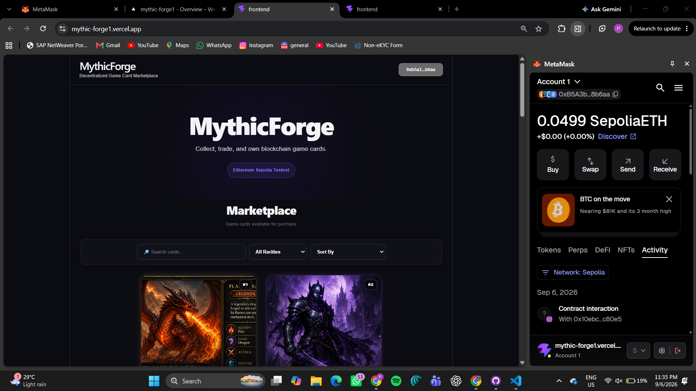

### 2. Marketplace

The marketplace displays available NFT game cards along with their rarity, attack, defense, price, and purchase options.

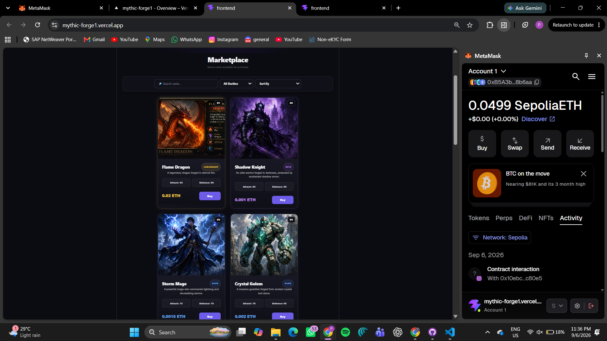

### 3. NFT Card Details

Detailed view of an NFT game card showing its token ID, attributes, current owner, marketplace status, price, and purchase option.

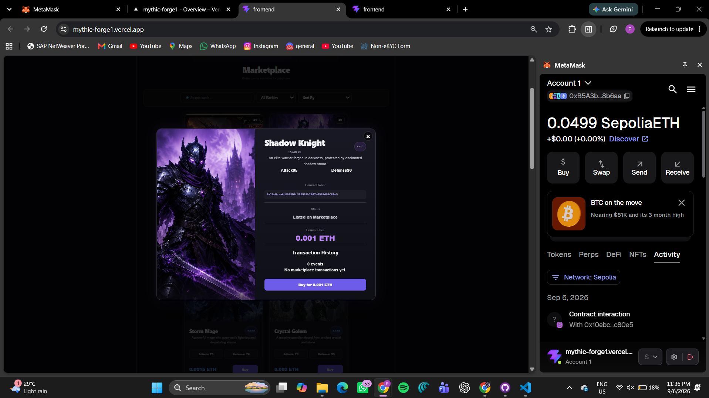

### 4. Transaction Failed

The frontend displays an error message when a blockchain transaction fails or is rejected.

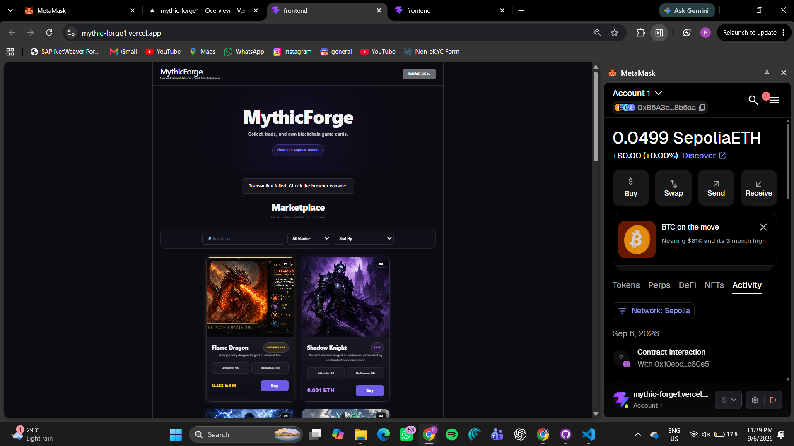

### 5. Buy Transaction Request

MetaMask transaction request for purchasing the Flame Dragon NFT using Sepolia ETH.

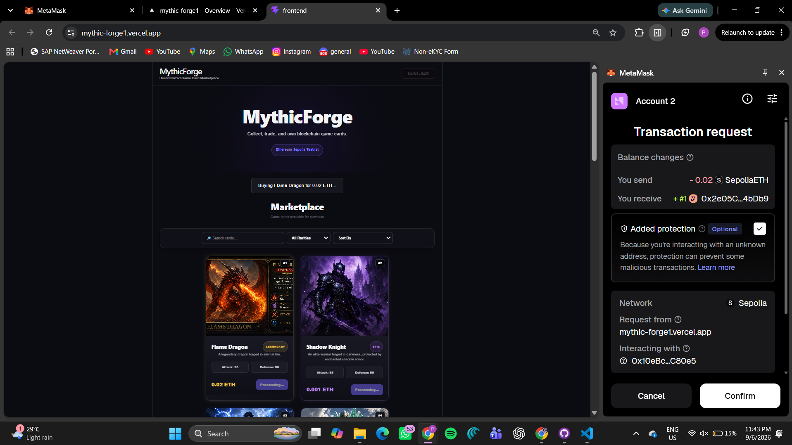

### 6. Transaction Submitted

The application waits for blockchain confirmation after the NFT purchase transaction is submitted through MetaMask.

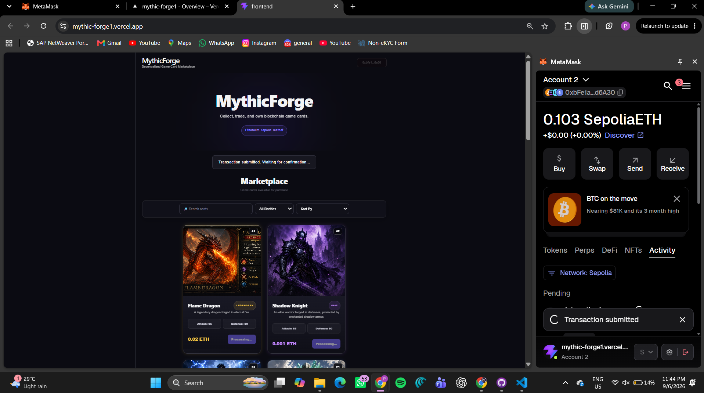

### 7. Collection Dashboard

The My Collection dashboard displays the NFTs owned by the connected wallet along with collection statistics and rarity information.

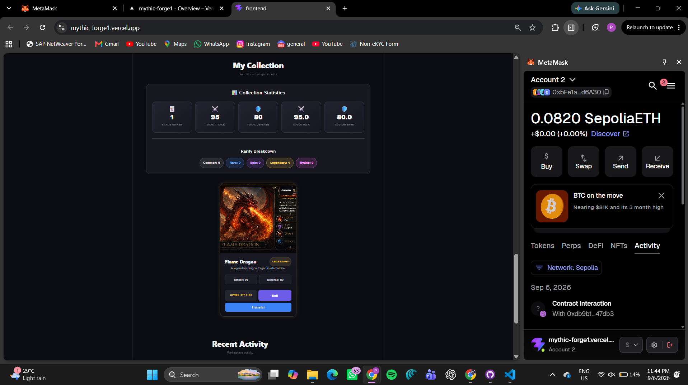

### 8. Recent Marketplace Activity

The Recent Activity section demonstrates marketplace transaction activity.

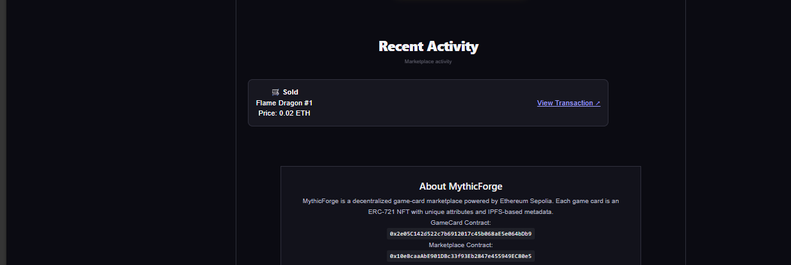

### 9. Blockchain Transaction Verification

A successful NFT transaction can be independently verified on the Ethereum Sepolia blockchain explorer.

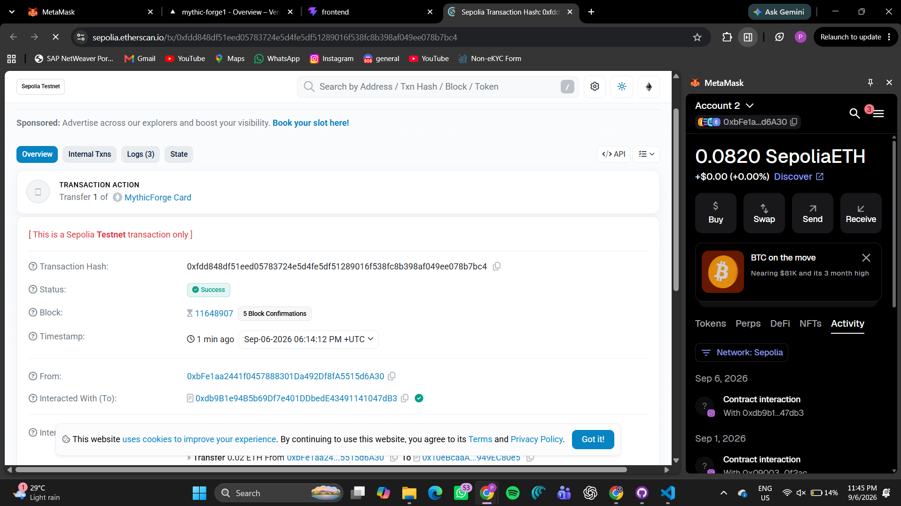

### 10. Sell NFT – Set Price

NFT owners can list their cards for sale by entering a selling price in ETH.

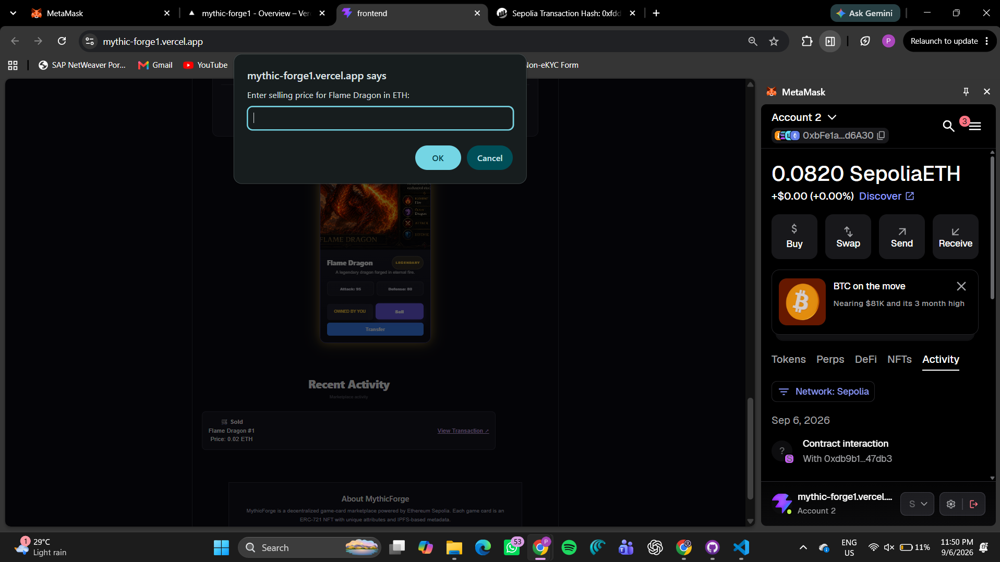

### 11. NFT Marketplace Approval

MetaMask requests approval before allowing the marketplace smart contract to transfer the NFT on behalf of its owner.

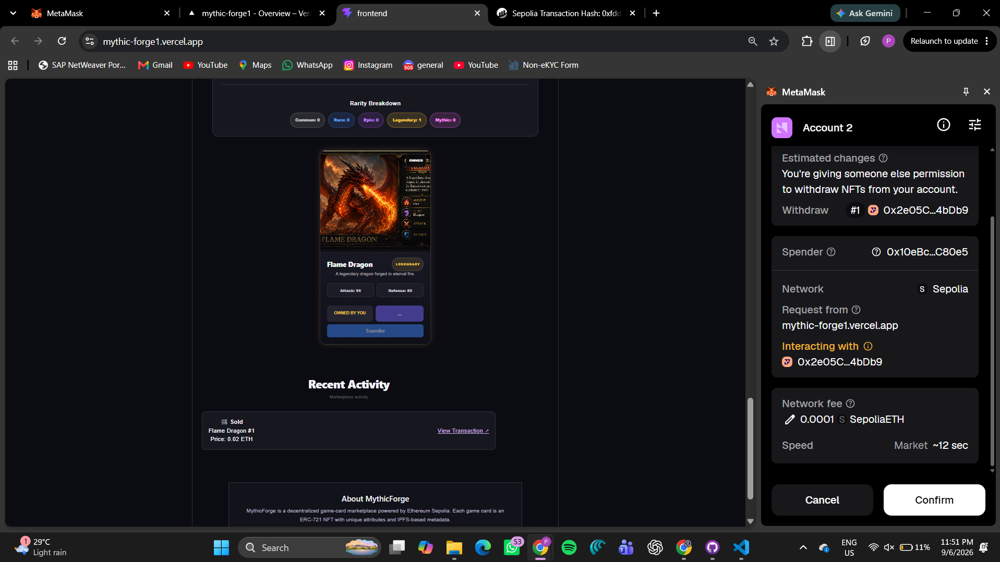

Deployment Information
Frontend

Deployed on Vercel:

https://mythic-forge1.vercel.app/
Blockchain
Network: Ethereum Sepolia Testnet
Chain ID: 11155111
Currency: Sepolia ETH
GameCard Contract
0x2e05C142d522c7b6912017c45b068aE5e064bDb9

GameCard Contract on Etherscan

Marketplace Contract
0x10eBcaaAbE901DBc33f93Eb2847e455949EC80e5

Marketplace Contract on Blockscout

Future Improvements

Potential future improvements include:

NFT filtering by rarity
Advanced marketplace search
Sorting by price and rarity
Marketplace activity history
Improved transaction history
Additional game-card attributes
Card battling functionality
Card upgrading and crafting
User profiles
Creator royalties
Multi-chain support
More advanced IPFS integrations
Improved mobile wallet compatibility
Project Highlights

MythicForge demonstrates practical implementation of:

Blockchain development
Solidity smart contracts
ERC-721 NFTs
NFT marketplaces
IPFS decentralized storage
MetaMask wallet integration
Ethereum Sepolia Testnet
Smart contract security
Automated contract testing
React and TypeScript frontend development
Vercel deployment
GitHub project management
Important Links
Live Demo
https://mythic-forge1.vercel.app/
GitHub Repository
https://github.com/prajit003/MythicForge
GameCard Contract
https://sepolia.etherscan.io/address/0x2e05C142d522c7b6912017c45b068aE5e064bDb9
Marketplace Contract
https://eth-sepolia.blockscout.com/address/0x10eBcaaAbE901DBc33f93Eb2847e455949EC80e5#code
License

This project is developed for educational and demonstration purposes.